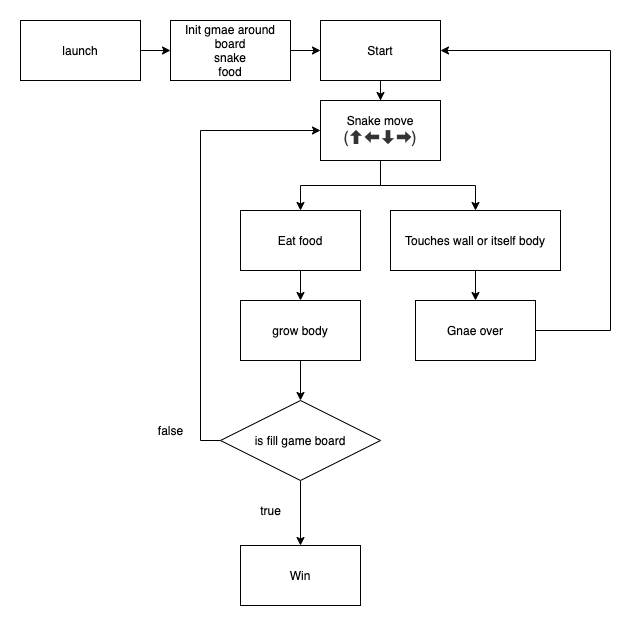

# Snake-swift
TDD, Game, Snake

* [Rule](#rule)
* [Flow](#flow)

## Rule

Reference [wiki](https://zh.wikipedia.org/wiki/%E8%B4%AA%E9%A3%9F%E8%9B%87)

-   Control the snakehead(⬆ ⬅ ⬇ ➡), and the snake can't back.
-   Have one food on the game board, and food can not create on the snake body.
-   If the snake eating the food, it will grow body.
-   Game over if the snake touches wall or itself body.

## Flow

